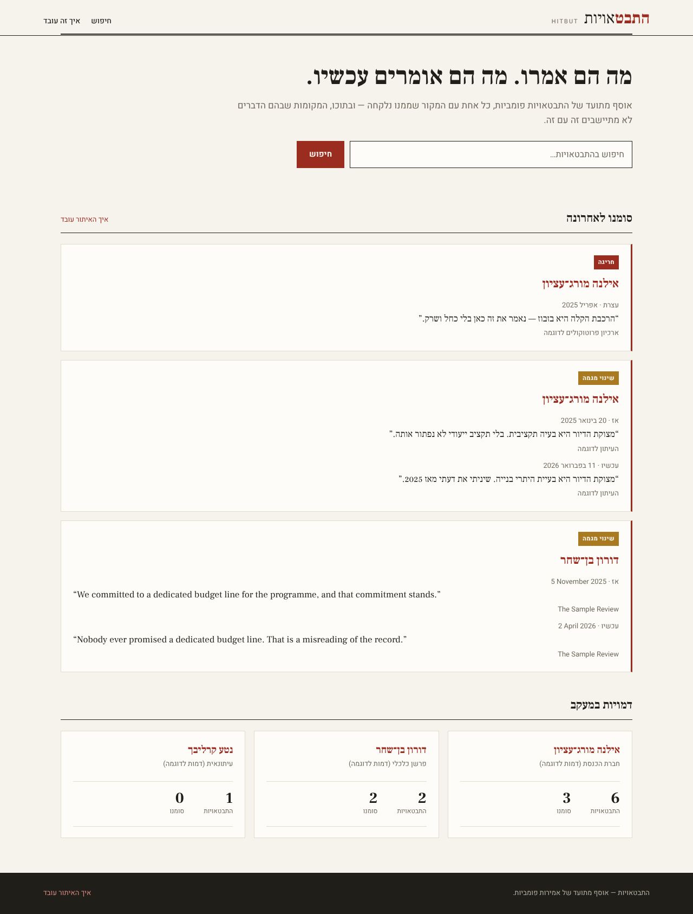
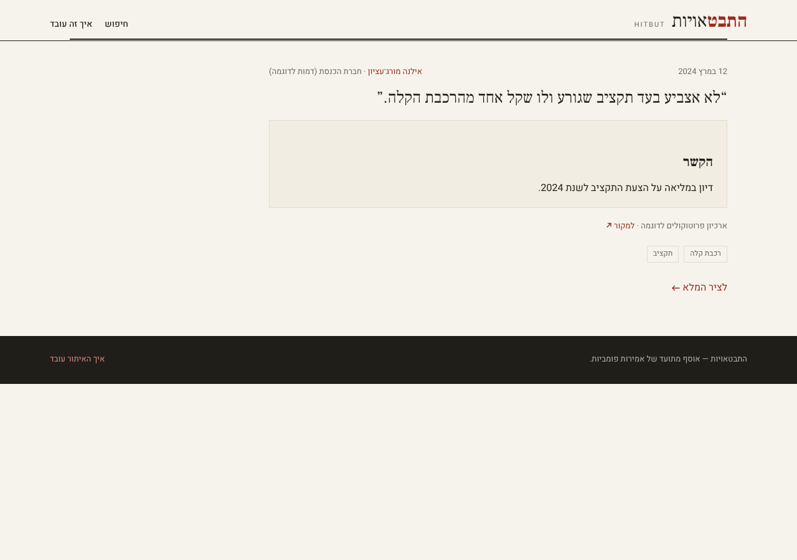
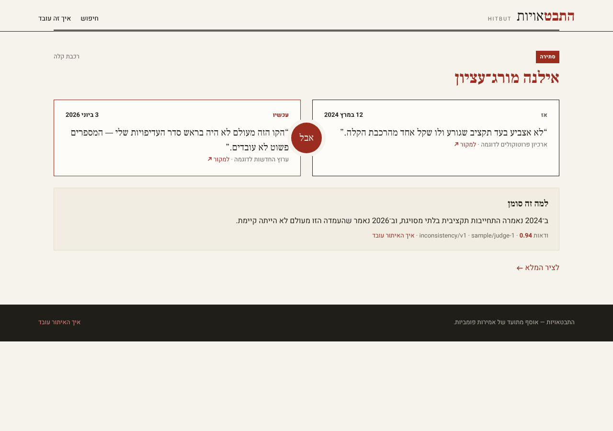
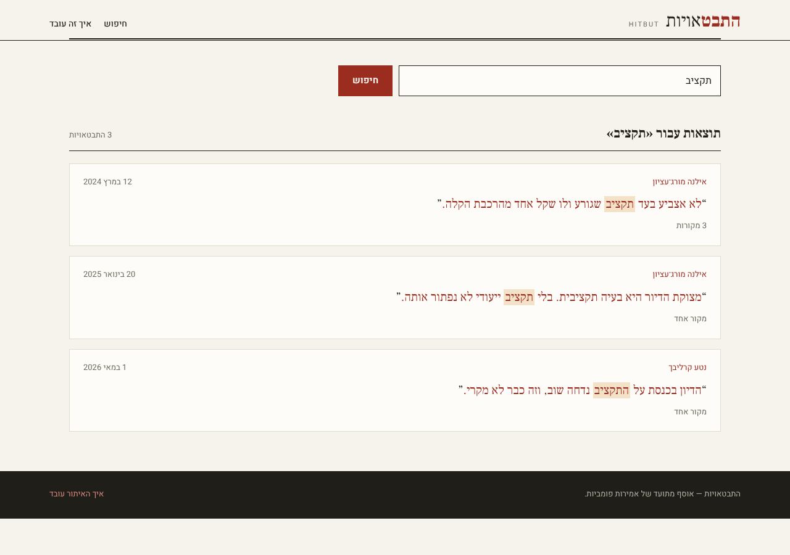
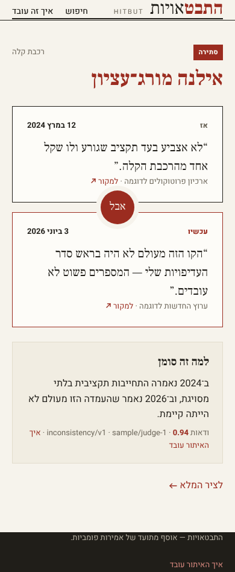
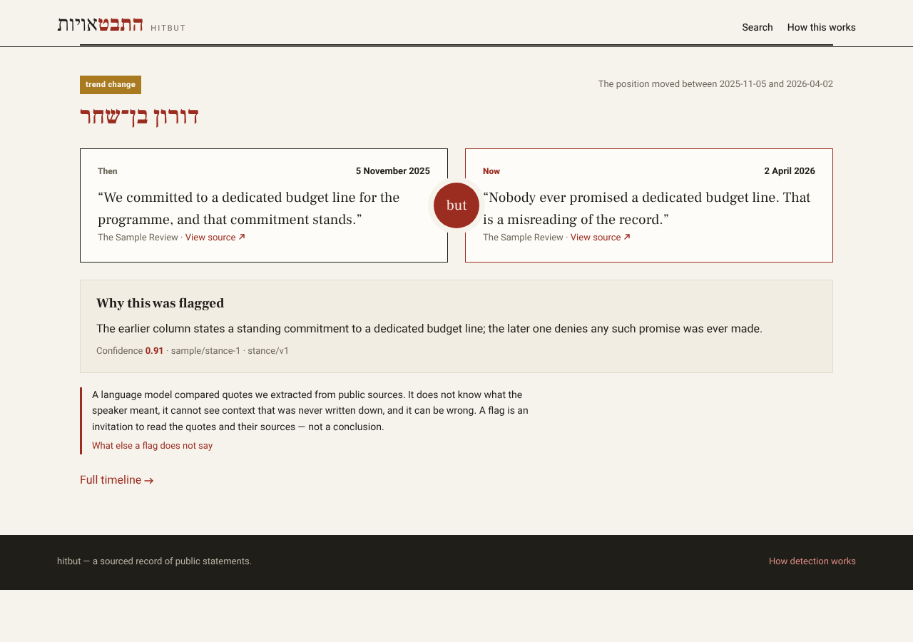

# hitbut — requirements

What hitbut must do, leaf by leaf. Every numbered leaf below is claimed by exactly one
executable case, of the kind that can actually observe what the leaf asserts; the coverage
gate fails if that stops being true. The mechanism behind these requirements — what runs
where and why — is [`docs/architecture/DESIGN.md`](../../docs/architecture/DESIGN.md); this
document is what the product must *do*, and the harness that runs it is
[`dev/requirements/README.md`](README.md).

> **Green here means "claimed by a passing case", not "verified in the world".** The
> server- and screen-kind cases run the shipped Worker on the real `workerd` runtime, but
> against local D1, R2 and Queues — they confirm our code *asks* Cloudflare for the right
> thing, not that Cloudflare performs it. That gap, and four others (the judge model is
> unevaluated for Hebrew, there is no real-source matrix yet, requirement `7.1` is
> provisional, the legal review is outstanding), are tracked in
> [#28](https://github.com/missingbulb/hitbut/issues/28).

**Scope of v1.** Israeli politicians, journalists and commentators; statements mostly in
Hebrew, some in English. The corpus is the product — a figure's record, checkable in one
place with the evidence attached — and inconsistency detection is one lens over it.

**A note on the sample data.** Every figure, quote, date and count in the fixtures and in
the committed screenshots is fictional. Nothing in this repository attributes a statement
to a real person.

---

## 1. Corpus and identifiers

Researchers and journalists cite these ids, so an id is a promise: it is never reused,
renumbered, or deleted, and retirement is a status rather than a removal.

- `1.1` A figure's id is a slug minted once at creation, and does not change when the figure's display name changes.
  

Detail

  The slug is derived from the name at creation — Hebrew stays Hebrew, since transliterating
  without vowels is a guess and a guess baked into a permanent id is a guess forever;
  collisions take a numeric suffix. From then on the id is opaque: renaming מורג to
  מורג־עציון updates `display_name` and leaves `id` alone, because a citation of the old URL
  must keep resolving.
  

- `1.2` A statement keeps the ULID it was given at first extraction when the same source payload is extracted again.
  

Detail

  Re-extraction happens whenever a parser is fixed and replayed over the R2 payload cache.
  Identity is `(source id, the statement's position in that payload)`; a second run over the
  same bytes must produce the same ids, or every citation breaks on every parser fix.
  

- `1.3` A statement whose source does not establish a date stores no date — not today's, not the epoch, not the fetch time.
  

Detail

  Unknown is a state of its own. The column is nullable, the API omits the key rather than
  sending a default, and the site renders "תאריך לא ידוע" — three stages, one meaning. A
  defaulted date would silently order a timeline wrongly and look entirely plausible.
  

- `1.4` A figure withdrawn from the product is marked retired and still resolves by id.
  

Detail

  Withdrawal is an editorial act (a misattribution, a person out of scope). The row stays,
  `status` becomes `retired`, listings exclude it, and a direct fetch by id still answers —
  with the status — so an old citation degrades to "this record was withdrawn" rather than
  to a 404.
  

- `1.5` Re-analysis of a statement pair writes a new inconsistency record and marks the previous one superseded, never overwriting it.
  

Detail

  A prompt or model change re-judges pairs. The old record keeps its id, gains
  `superseded_by`, and drops out of the surfaced set; the new record is the live one. A
  reader who cited the old judgment can still see exactly what was said and what replaced it.
  

- `1.6` Two statements minted in the same millisecond get distinct ids that still sort in mint order.
  

Detail

  A single payload yields many statements at once. ULID monotonicity within a millisecond
  is what keeps "the order they were extracted in" recoverable from the ids alone.
  

- `1.7` One thing said, reported by several documents, is one utterance with several attestations.
  

Detail

  A speech carried by five outlets is one thing that was said and five documents reporting
  it. Stored as five records instead, a persona's timeline is five copies of one sentence,
  and analysis compares them with each other and reads the echo as agreement. Identity is
  the speaker, the date, and the folded text; the utterance keeps the fullest wording any
  document carries, because a quote trimmed for space should not become the record.
  

- `1.8` An utterance records the venue it was made in and the audience it was addressed to; an attestation records who reported it.
  

Detail

  Two different things, and both are needed. *Where it was said and to whom* is a property
  of the speech act — the same words to a committee and to a rally are two utterances, and
  the difference between them is the point of an anomaly. *Who reported it* is a property
  of each document. For an op-ed the two coincide, which is consistent rather than
  contradictory: the venue is that publication and there is one attestation from it.
  

- `1.9` A date a source establishes only to the month is stored as a month — distinct from a day and from unknown.
  

Detail

  Thirty years back, a source often gives "March 1998" and no more. Recording that as the
  first of the month invents a fact a timeline will then sort by; recording it as unknown
  throws away most of what the source did say. Three states, carried separately: a date
  with the precision it was established to, and no date at all.
  

## 2. Hebrew-aware search

SQLite's FTS tokenizers split Hebrew on whitespace and nothing else, so `בכנסת` and `כנסת`
are unrelated words to them. Hebrew glues its prepositions, articles and conjunctions onto
the front of the word, so an unaided index answers "no results" for most of the ways a
person actually types. hitbut folds the text itself, on both sides of the query.

- `2.1` A search for a Hebrew word matches statements where that word carries an attached prefix.
  

Detail

  Querying `כנסת` matches text containing `בכנסת`, `לכנסת`, `שבכנסת`. The indexer emits both
  the surface token and its stripped stem; the query does the same, so the match happens in
  the index rather than in a `LIKE` scan.
  

- `2.2` A word written with a final-form letter matches the same word written without it, and the reverse.
  

Detail

  ם/מ, ן/נ, ך/כ, ף/פ, ץ/צ are positional variants of one letter. Sources disagree about
  them — an acronym or a transliteration puts one mid-word, a hurried query types the other
  — and treating them as different letters answers "no results" for a word the corpus
  certainly contains. The fold runs on both sides, so `ירושלים` and `ירושלימ` are one term.
  

- `2.3` Niqqud, geresh and gershayim are folded away before indexing and before matching.
  

Detail

  `ח״כ` and `חכ` are the same query; a vocalised quote from a formal transcript must meet an
  unvocalised one from a press release.
  

- `2.4` A Latin-script query matches Latin statement text and is not touched by the Hebrew folding.
  

Detail

  Not every statement in scope is Hebrew. `budget` must not be stemmed by rules meant for
  Hebrew prefixes, and a mixed-script statement is indexed under both scripts.
  

- `2.5` A prefix is never stripped down to a stem too short to be a word.
  

Detail

  `בית` must not be indexed as `ית`, and `של` must not become `ל`. A strip that would leave
  fewer than three letters is not made, so the surface token is the only thing indexed.
  Without the floor, the commonest short words match nearly everything.
  

## 3. Acquisition

Sources are other organisations' websites, reached without a contract: no changelog, no
SLA, no support channel. Every leaf here exists to make a source's failure legible instead
of turning it into corrupt data.

- `3.1` The raw payload is written to the cache before anything parses it.
  

Detail

  Ordering, not merely presence: the R2 write happens before the extractor is called, so a
  payload that crashes the parser is still on disk to debug against and to replay.
  

- `3.2` A fetch retries only the statuses another attempt could improve, and fails a client error on the first attempt.
  

Detail

  408, 429, 500, 502, 503, 504 are worth another attempt with backoff. Any other 4xx is
  about our request and will answer identically forever; retrying it wastes the budget and
  looks like traffic worth blocking.
  

- `3.3` A response whose body carries a bot-wall marker is recorded as blocked, never as content.
  

Detail

  An anti-bot interstitial arrives as a perfectly ordinary 200. Caching it stores a
  challenge page that looks like data; the marker scan makes it a distinct, reportable
  failure reason for that source.
  

- `3.4` An empty body is a failure of that fetch, and is not retried.
  

Detail

  Nothing rendered. A successful-but-empty response will keep being successful and empty, so
  the retry budget buys nothing.
  

- `3.5` One item failing in a batch is recorded with its reason and the rest of the batch still lands.
  

Detail

  A run over a day of protocols must not lose the day because one document 404s. The run
  reports per-item reasons and exits successfully — a declined item is a signal for a human,
  not a broken pipeline.
  

- `3.6` A re-run fetches only what is missing, unless a refresh is forced.
  

Detail

  Resumability measured against the cache: a second pass over the same window issues no
  requests. `force` re-fetches deliberately, which is the only way a changed upstream page
  is re-read.
  

- `3.7` A source module that does not declare its data surface and its refresh clock is refused by the registry.
  

Detail

  The surface (`hydration` | `api` | `markup`) records which reconnaissance answer this
  parser rests on; the clock records how fast that source actually moves. Both are required
  at registration, so neither can be left to a comment.
  

- `3.8` Extraction replays from the cached payload without touching the network.
  

Detail

  A parser fix costs zero requests. The case runs extraction with the fetcher wired to throw
  on any call, so a network read is a test failure rather than a slow test.
  

## 4. Analysis

Detection has to be defensible before it is clever: for every flag, a reader can see which
two statements were compared, what was said about them, and by which model and prompt.

- `4.1` Candidate pairs are drawn only from one figure's own statements, and only where the topics overlap.
  

Detail

  Two figures disagreeing is not an inconsistency, and one figure's unrelated statements are
  not a pair worth a model call. Pairing is the cost control and the correctness rule at once.
  

- `4.2` A pair the judge calls contradictory is stored as kind `contradiction`.
- `4.3` A pair the judge calls a change of position over time is stored as kind `position-shift`.
  

Detail

  Distinct on purpose: a politician who changed their mind and said so is a different claim
  about them than one who denies ever holding the position. The site labels them differently.
  

- `4.4` A pair the judge calls consistent is stored with its score and never surfaced.
  

Detail

  Keeping the negatives is what makes the threshold tunable later, and what stops the same
  pair being paid for twice.
  

- `4.5` Every stored judgment carries both statement ids, the rationale, and the model and prompt version that produced it.
  

Detail

  The defensible trail. A prompt is a committed, versioned file; the version travels with
  every record it produced, so "which prompt said this?" is answerable years later.
  

- `4.6` A judgment scoring below the surfacing threshold is retained and excluded from the surfaced set.
  

Detail

  Only high-confidence pairs reach the product; the full distribution stays for tuning.
  Surfacing is a query, not a delete.
  

## 5. HTTP API

Public, read-only JSON under `/api/v1`. The only writers are the cron trigger and the queue
consumer; everything a reader sees comes through here, including the site's own pages.

- `5.1` `GET /api/v1/figures` lists figures with a cursor, and that cursor returns the next page without repeats.
- `5.2` `GET /api/v1/figures/{id}` returns the profile with its statement timeline, newest first.
- `5.3` `GET /api/v1/statements/{id}` returns the quote, its context, and the source it came from.
- `5.4` `GET /api/v1/inconsistencies` returns surfaced records only, newest first.
- `5.5` `GET /api/v1/inconsistencies/{id}` resolves a superseded record and names what superseded it.
  

Detail

  The other half of `1.5`: the invariant is only worth anything if the boundary honours it.
  A cited link to a superseded judgment answers 200 with the record and a pointer forward.
  

- `5.6` `GET /api/v1/search?q=` answers a Hebrew query whose term carries an attached prefix.
  

Detail

  The boundary's half of `2.1`. The logic case proves the folding; this proves the deployed
  route actually runs it against the real index.
  

- `5.7` Every response carries open CORS headers.
- `5.8` A write method is rejected with 405.
  

Detail

  There is no write surface to authenticate, so the boundary states that rather than
  implying it by routing failure.
  

- `5.9` An unknown path answers 404 with the JSON error envelope, not an HTML page.
- `5.10` An unknown figure answers 404, never an empty 200.
  

Detail

  An empty 200 for a missing entity turns a typo into "this person has said nothing",
  which is the single most defamatory thing an empty page could imply here.
  

- `5.11` `GET /api/v1/export/statements.ndjson` serves the whole corpus as one JSON object per line.
  

Detail

  What a researcher reads instead of paginating the corpus: statement, speaker and source
  per line, with the stable ids intact so a later pull can be diffed against this one. It
  is a snapshot the scheduled run regenerates, not a query assembled per request — and
  before the first run has written one, the route says exactly that rather than serving an
  empty file that reads like an empty corpus.
  

## 6. The site

RTL-first, Hebrew-primary, with the same layout mirrored for LTR content. Each leaf's
expected result is the committed screenshot below it: approving the image is approving the
page. The design system these render is the warm-editorial direction the owner approved on
the design canvas.

- `6.1` The home page leads with the search, then the most recent surfaced inconsistencies, then the tracked figures.
<!-- gallery:6.1 -->

<!-- /gallery:6.1 -->

- `6.2` A figure page shows the profile, the counts, the topics, and the statement timeline with flagged statements marked.
<!-- gallery:6.2 -->

<!-- /gallery:6.2 -->

- `6.3` A statement page shows the quote, its date, its context, and a link to the source it was taken from.
<!-- gallery:6.3 -->

<!-- /gallery:6.3 -->

- `6.4` An inconsistency page shows the two statements side by side, separated by the «אבל» mark, with the rationale and both sources.
<!-- gallery:6.4 -->

<!-- /gallery:6.4 -->

- `6.5` A search results page shows what matched, with the query's term highlighted in each result.
<!-- gallery:6.5 -->

<!-- /gallery:6.5 -->

- `6.6` The methodology page states in plain Hebrew what detection confirms and what it does not, and how to report an error.
  

Detail

  The honest-gap sentence, on the page a reader can reach from every flag: the model
  compares two quotes we extracted from two sources, and says why it thinks they conflict —
  it does not know what the person meant, and it can be wrong. Directly beside it: how to
  tell us it is wrong.
  

<!-- gallery:6.6 -->

<!-- /gallery:6.6 -->

- `6.7` At phone width the inconsistency page stacks the two statements vertically with the mark between them.
<!-- gallery:6.7 -->

<!-- /gallery:6.7 -->

- `6.8` An English statement renders the whole page LTR, with the mark reading "but".
  

Detail

  Direction follows the content's language, not a site-wide setting: an English pair is a
  left-to-right page in the same design system, which is what keeps non-Hebrew sources
  inside v1 rather than deferred.
  

<!-- gallery:6.8 -->

<!-- /gallery:6.8 -->

## 7. Shipping

- `7.1` A merge to `main` reaches the deployed site with no human build step. **[provisional — no case]**
  

Detail

  Listed in `dev/requirements/provisional.json`, which is the coverage gate's burn-down
  list and currently holds this one entry. It cannot be asserted from a test: it is a claim
  about a live account, and it burns down when phase 0 provisioning
  ([#27](https://github.com/missingbulb/hitbut/issues/27)) lands and a merge is observed end
  to end.
  

