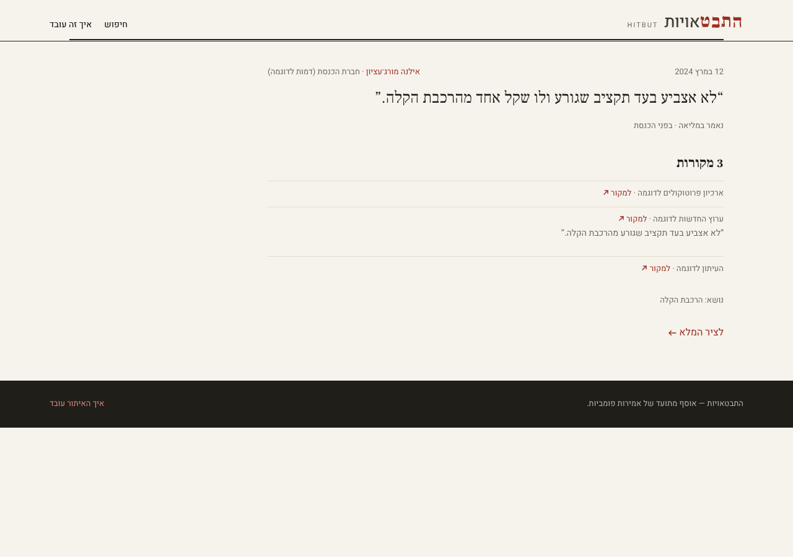
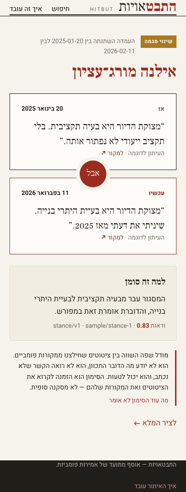
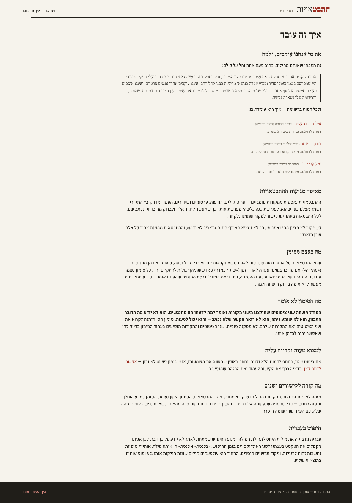
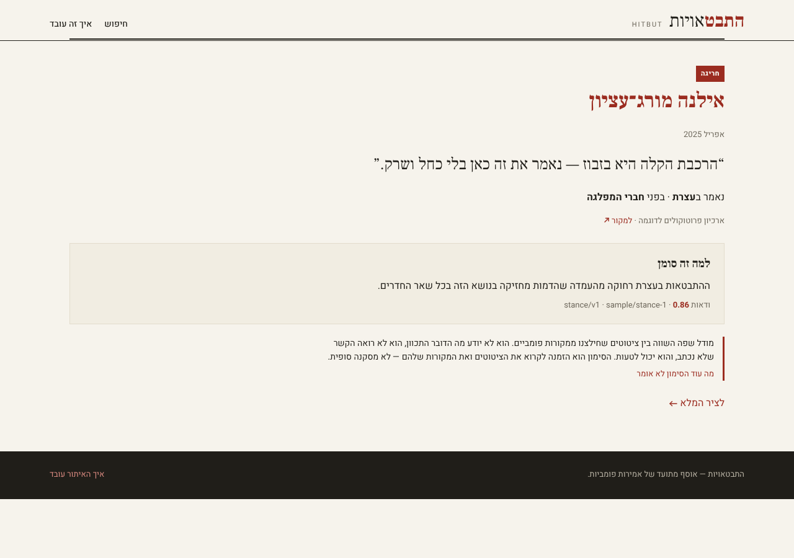
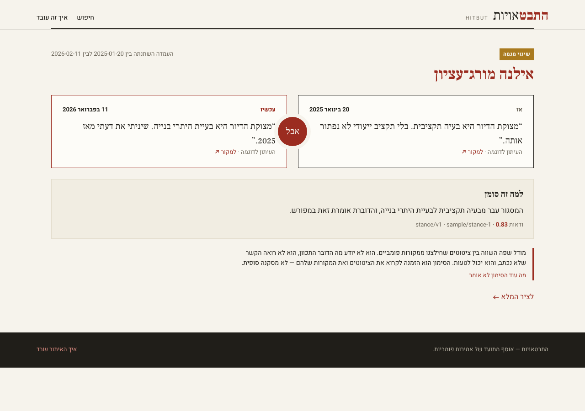
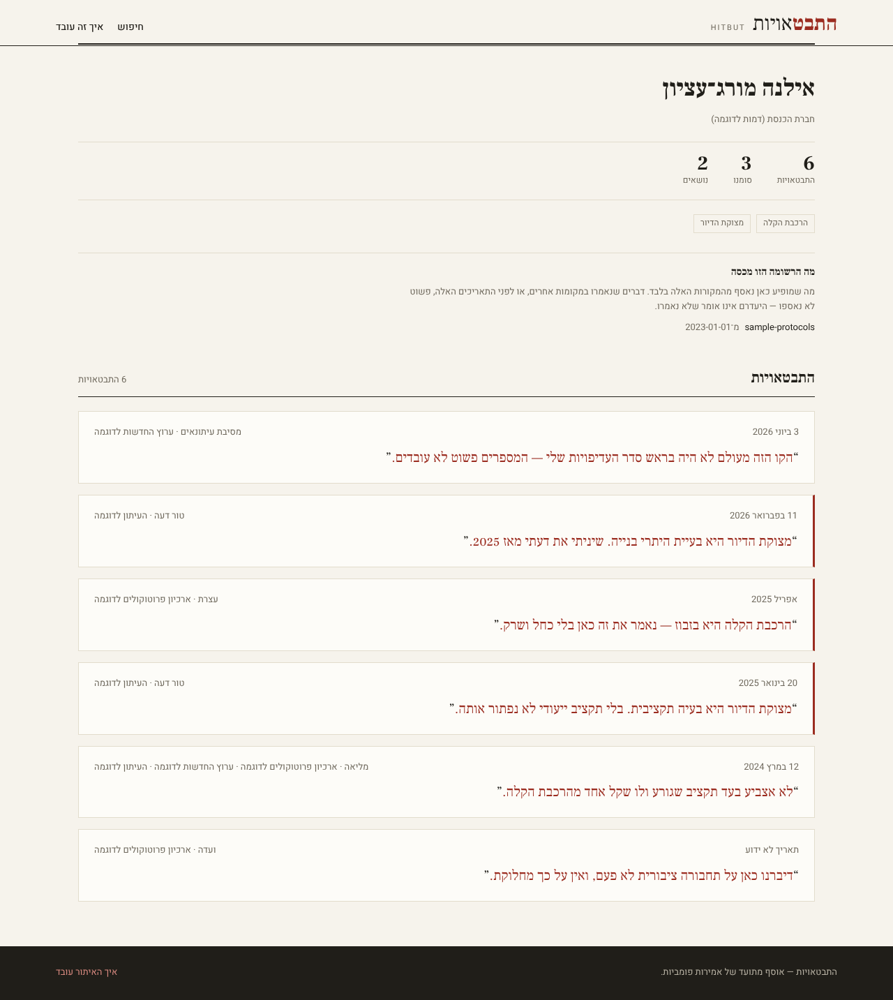

# hitbut — requirements

What hitbut must do, leaf by leaf. Every numbered leaf below is claimed by exactly one
executable case, of the kind that can actually observe what the leaf asserts; the coverage
gate fails if that stops being true. The mechanism behind these requirements — what runs
where and why — is [`docs/architecture/DESIGN.md`](../../docs/architecture/DESIGN.md); this
document is what the product must *do*, and the harness that runs it is
[`dev/requirements/README.md`](README.md).

> **Green here means "claimed by a passing case", not "verified in the world".** The
> server- and screen-kind cases run the shipped Worker on the real `workerd` runtime, but
> against local D1 and R2 — they confirm our code *asks* Cloudflare for the right thing,
> not that Cloudflare performs it. That gap, and four others (no embedding or stance model
> has been chosen, let alone evaluated for Hebrew; there is no real-source matrix yet;
> requirement `7.1` is provisional; the legal review is outstanding), are tracked in
> [#28](https://github.com/missingbulb/hitbut/issues/28).

**Scope of v1.** Israeli politicians, journalists and commentators; utterances mostly in
Hebrew, some in English. The corpus is the product — a figure's record, checkable in one
place with the evidence attached — and inconsistency detection is one lens over it.

**A note on the sample data.** Every figure, quote, date and count in the fixtures and in
the committed screenshots is fictional. Nothing in this repository attributes an utterance
to a real person.

---

## 1. Corpus and identifiers

Researchers and journalists cite these ids, so an id is a promise: it is never reused,
renumbered, or deleted, and retirement is a status rather than a removal.

- `1.1` A figure's id is a slug minted once at creation, and does not change when the figure's display name changes.
  

Detail

  The slug is derived from the name once, when the person's roster entry is authored —
  Hebrew stays Hebrew, since transliterating without vowels is a guess and a guess baked
  into a permanent id is a guess forever; collisions take a numeric suffix. From then on the
  id is opaque and the entry carries it: renaming מורג to מורג־עציון in the roster updates
  `display_name` and leaves `id` alone, because a citation of the old URL must keep
  resolving.
  

- `1.3` An utterance whose sources establish no date stores no date — not today's, not the epoch, not the fetch time.
  

Detail

  Unknown is a state of its own. The column is nullable, the API omits the key rather than
  sending a default, and the site renders "תאריך לא ידוע" — three stages, one meaning. A
  defaulted date would silently order a timeline wrongly and look entirely plausible.
  

- `1.4` A figure withdrawn from the product is marked retired and still resolves by id.
  

Detail

  Withdrawal is an editorial act (a misattribution, a person out of scope). The row stays,
  `status` becomes `retired`, listings exclude it, and a direct fetch by id still answers —
  with the status — so an old citation degrades to "this record was withdrawn" rather than
  to a 404.
  

- `1.6` Two utterances minted in the same millisecond get distinct ids that still sort in mint order.
  

Detail

  A single payload yields many utterances at once. ULID monotonicity within a millisecond
  is what keeps "the order they were extracted in" recoverable from the ids alone — which is
  the only ordering the corpus can honestly claim about utterances nobody dated.
  

- `1.7` One thing said, reported by several documents, is one utterance with several attestations.
  

Detail

  A speech carried by five outlets is one thing that was said and five documents reporting
  it. Stored as five records instead, a persona's timeline is five copies of one sentence,
  and analysis compares them with each other and reads the echo as agreement. Identity is
  the speaker, the date, and the folded text; the utterance keeps the fullest wording any
  document carries, because a quote trimmed for space should not become the record.
  

- `1.8` An utterance records the venue it was made in and the audience it was addressed to; an attestation records who reported it.
  

Detail

  Two different things, and both are needed. *Where it was said and to whom* is a property
  of the speech act — the same words to a committee and to a rally are two utterances, and
  the difference between them is the point of an anomaly. *Who reported it* is a property
  of each document. For an op-ed the two coincide, which is consistent rather than
  contradictory: the venue is that publication and there is one attestation from it.
  

- `1.9` A date a source establishes only to the month is stored as a month — distinct from a day and from unknown.
  

Detail

  Thirty years back, a source often gives "March 1998" and no more. Recording that as the
  first of the month invents a fact a timeline will then sort by; recording it as unknown
  throws away most of what the source did say. Three states, carried separately: a date
  with the precision it was established to, and no date at all.
  

- `1.10` A subject is a cluster the corpus discovers; an utterance about something new opens one, with no vocabulary edited anywhere.
  

Detail

  A committed list of topics decides in advance what the corpus is allowed to be about,
  and two sources describing one subject in different words never meet. So a cluster is a
  row that an utterance can open, and the label a reader sees is regenerated from the
  cluster's members — display only. Pairing and detection key on the id, never the label,
  which is why relabelling a cluster must move nothing.
  

- `1.11` A stance places one utterance on one cluster's axis and carries the model and prompt version that produced it.
  

Detail

  Embedding distance measures aboutness, not agreement — "I will not cut a shekel from
  this line" and "this line was never a priority of mine" sit close together precisely
  because they are about the same thing. So position is a separate, recorded judgment
  rather than something read off the geometry, and it is only defensible if a reader can
  see which model and which prompt produced it.
  

- `1.12` Re-analysis writes a new finding and marks the previous one superseded; the superseded finding still resolves and names what replaced it.
  

Detail

  A finding is citable, so it cannot become a different claim under the same id, and it
  cannot vanish. So a re-analysis leaves the old record exactly as it was, gives it a
  pointer forward, and drops it out of the surfaced set — the new one is the live one, and
  a reader who cited the old finding can still see what was said and what replaced it.
  

- `1.13` A finding names the utterances it rests on, and carries the attribute its kind turns on — an anomaly the venue and audience, a trend change the interval.
  

Detail

  The two kinds answer different questions. An anomaly's interesting part is *who they
  were talking to*, so a finding without a venue is not an anomaly anyone can act on. A
  trend change's is *when it moved*, and the honest answer is an interval rather than a
  date, because a series says the change falls between two observations and no more. A
  record that can be stored missing its own point would let detection produce findings
  that read as complete and are not.
  

- `1.14` A speaker who is not on the committed roster does not become a tracked figure.
  

Detail

  A committee protocol names witnesses, petitioners, clerks and private citizens giving
  testimony. If the roster is whatever got crawled, each of them gets a slug, a page, a
  timeline and eventually an inconsistency flag — which is the exposure this product must
  not create, and under Israeli defamation law a serious one. Who we track is a reviewed
  decision that arrives as an input to acquisition, never a byproduct of it.
  

- `1.15` A passage by a speaker we do not track is retained under the name the source gave, and does not renumber the passages around it.
  

Detail

  Not tracked is not the same as not recorded. Dropping the passage would make the raw
  record incomplete and would silently decide, at crawl time, something a person should
  decide; promoting it would create the tracked figure `1.14` forbids. So it is held with
  the speaker's name exactly as the document wrote it, waiting for that decision — and the
  passages that *did* resolve keep the positions they had in the payload, so adding the
  speaker to the roster later cannot move anybody's id.
  

- `1.16` The roster states the public-eye test it applies, and every entry says how its person meets it; a roster missing either is refused.
  

Detail

  Two halves, and both are load-bearing. The **test** is written once and applies to
  everybody, so who we track is a rule rather than a series of individual judgements — the
  difference between a roster and a list of people somebody decided to scrutinise. The
  **entry** then says how that person meets it, so the rule is applied visibly rather than
  asserted. Refusing the file when either is missing is what stops both being optional in
  practice.
  

## 2. Hebrew-aware search

SQLite's FTS tokenizers split Hebrew on whitespace and nothing else, so `בכנסת` and `כנסת`
are unrelated words to them. Hebrew glues its prepositions, articles and conjunctions onto
the front of the word, so an unaided index answers "no results" for most of the ways a
person actually types. hitbut folds the text itself, on both sides of the query.

- `2.1` A search for a Hebrew word matches utterances where that word carries an attached prefix.
  

Detail

  Querying `כנסת` matches text containing `בכנסת`, `לכנסת`, `שבכנסת`. The indexer emits both
  the surface token and its stripped stem; the query does the same, so the match happens in
  the index rather than in a `LIKE` scan.
  

- `2.2` A word written with a final-form letter matches the same word written without it, and the reverse.
  

Detail

  ם/מ, ן/נ, ך/כ, ף/פ, ץ/צ are positional variants of one letter. Sources disagree about
  them — an acronym or a transliteration puts one mid-word, a hurried query types the other
  — and treating them as different letters answers "no results" for a word the corpus
  certainly contains. The fold runs on both sides, so `ירושלים` and `ירושלימ` are one term.
  

- `2.3` Niqqud, geresh and gershayim are folded away before indexing and before matching.
  

Detail

  `ח״כ` and `חכ` are the same query; a vocalised quote from a formal transcript must meet an
  unvocalised one from a press release.
  

- `2.4` A Latin-script query matches Latin utterance text and is not touched by the Hebrew folding.
  

Detail

  Not every utterance in scope is Hebrew. `budget` must not be stemmed by rules meant for
  Hebrew prefixes, and a mixed-script utterance is indexed under both scripts.
  

- `2.5` A prefix is never stripped down to a stem too short to be a word.
  

Detail

  `בית` must not be indexed as `ית`, and `של` must not become `ל`. A strip that would leave
  fewer than three letters is not made, so the surface token is the only thing indexed.
  Without the floor, the commonest short words match nearly everything.
  

## 3. Acquisition

Sources are other organisations' websites, reached without a contract: no changelog, no
SLA, no support channel. Every leaf here exists to make a source's failure legible instead
of turning it into corrupt data.

- `3.1` The raw payload is written to the cache before anything parses it.
  

Detail

  Ordering, not merely presence: the R2 write happens before the extractor is called, so a
  payload that crashes the parser is still on disk to debug against and to replay.
  

- `3.2` A fetch retries only the statuses another attempt could improve, and fails a client error on the first attempt.
  

Detail

  408, 429, 500, 502, 503, 504 are worth another attempt with backoff. Any other 4xx is
  about our request and will answer identically forever; retrying it wastes the budget and
  looks like traffic worth blocking.
  

- `3.3` A response whose body carries a bot-wall marker is recorded as blocked, never as content.
  

Detail

  An anti-bot interstitial arrives as a perfectly ordinary 200. Caching it stores a
  challenge page that looks like data; the marker scan makes it a distinct, reportable
  failure reason for that source.
  

- `3.4` An empty body is a failure of that fetch, and is not retried.
  

Detail

  Nothing rendered. A successful-but-empty response will keep being successful and empty, so
  the retry budget buys nothing.
  

- `3.5` One item failing in a batch is recorded with its reason and the rest of the batch still lands.
  

Detail

  A run over a day of protocols must not lose the day because one document 404s. The run
  reports per-item reasons and exits successfully — a declined item is a signal for a human,
  not a broken pipeline.
  

- `3.6` A re-run fetches only what is missing, unless a refresh is forced.
  

Detail

  Resumability measured against the cache: a second pass over the same window issues no
  requests. `force` re-fetches deliberately, which is the only way a changed upstream page
  is re-read.
  

- `3.7` A source module that has not declared what the pipeline needs — its data surface, its refresh clock, the room it reports from — is refused by the registry.
  

Detail

  The surface (`hydration` | `api` | `markup`) records which reconnaissance answer this
  parser rests on; the clock records how fast that source actually moves. Both are required
  at registration, so neither can be left to a comment.
  

- `3.8` Extraction replays from the cached payload without touching the network.
  

Detail

  A parser fix costs zero requests. The case runs extraction with the fetcher wired to throw
  on any call, so a network read is a test failure rather than a slow test.
  

- `3.9` Replaying a payload through ingestion writes nothing new — not an utterance, not an attestation, not a subject, not a stance.
  

Detail

  Backfilling decades means replaying: a parser fix re-runs every cached payload, and a
  Workflow step that failed re-runs the slice it was in. If a replay wrote second copies,
  a persona's timeline would fill with duplicates of one sentence and the analysis would
  read the echo as agreement — the exact failure the utterance/attestation split exists to
  prevent, arriving from the other direction. Every stage is keyed on something the payload
  itself determines, so a second run finds its own work already done.
  

- `3.10` A stage that fails leaves the stages before it landed, and the next pass resumes from there.
  

Detail

  Embedding and stance are model calls: they rate-limit, time out, and cost money. A pass
  that lost the utterance because the stance call failed would re-fetch, re-extract and
  re-merge to get back to where it was, and would pay for the whole chain again on every
  retry. So each stage commits before the next one starts, and the pipeline reports how far
  it got rather than raising — the report is what a Workflow step reads to decide whether to
  retry.
  

## 4. Analysis

Detection has to be defensible before it is clever: for every flag, a reader can see which
utterances a finding rests on, what was said about them, and by which model and prompt.

- `4.1` Detection reads one persona's own stance series and never compares them with anybody else's.
  

Detail

  Two people disagreeing is not an inconsistency — it is two people disagreeing, which is
  what public life is. The claim this product makes is about one persona's own record over
  time, so a series is read within one persona and one subject and never across two.
  

- `4.6` A finding scoring below the surfacing threshold is retained and excluded from the surfaced set.
  

Detail

  Only high-confidence findings reach the product; everything the detector produced stays,
  so the threshold can be moved later without re-paying for the analysis. Surfacing is a
  query, not a delete.
  

- `4.7` A stance that deviates from the persona's prevailing position on a subject is found, and the finding carries where it was said and to whom.
  

Detail

  The anomaly. What makes it worth surfacing is not that a position moved but that it moved
  *here* — so a finding without the venue is not a claim anyone can act on, and the store
  refuses one. The comparison is against the persona's own prevailing stance on that
  subject, never against another persona: two people disagreeing is not an inconsistency.
  

- `4.8` A stance series that steps from one level to another yields a trend change reporting the interval the step falls in.
  

Detail

  The change point. A series bounds the change between the last utterance before it and the
  first after it, and no further — a single date would be a claim it cannot support. *Why*
  the position moved is out of scope; a bounded, sourced "between these two dates, this
  moved" is what the corpus can actually say.
  

- `4.9` A series that holds one position, and one too short to have a shape, yield nothing.
  

Detail

  The half that keeps the other two honest. A detector that finds something in every series
  finds nothing: a persona who has been consistent must come back empty, and two or three
  utterances are not a trend however far apart they sit. Silence on a flat series is the
  only evidence that a finding on a moving one means anything.
  

## 5. HTTP API

Public, read-only JSON under `/api/v1`. The only writers are the cron trigger and the queue
consumer; everything a reader sees comes through here, including the site's own pages.

- `5.1` `GET /api/v1/figures` lists figures with a cursor, and that cursor returns the next page without repeats.
- `5.2` `GET /api/v1/figures/{id}` returns the profile with its utterance timeline, newest first.
- `5.3` `GET /api/v1/utterances/{id}` returns what was said, where and to whom, and every document that reported it.
- `5.4` `GET /api/v1/findings` returns live surfaced findings only, newest first.
- `5.5` `GET /api/v1/findings/{id}` resolves a superseded finding and names what superseded it.
  

Detail

  The other half of `1.12`: the invariant is only worth anything if the boundary honours it.
  A cited link to a superseded finding answers 200 with the record and a pointer forward.
  

- `5.6` `GET /api/v1/search?q=` answers a Hebrew query whose term carries an attached prefix.
  

Detail

  The boundary's half of `2.1`. The logic case proves the folding; this proves the deployed
  route actually runs it against the real index.
  

- `5.7` Every response carries open CORS headers.
- `5.8` A write method is rejected with 405.
  

Detail

  There is no write surface to authenticate, so the boundary states that rather than
  implying it by routing failure.
  

- `5.9` An unknown path answers 404 with the JSON error envelope, not an HTML page.
- `5.10` An unknown figure answers 404, never an empty 200.
  

Detail

  An empty 200 for a missing entity turns a typo into "this person has said nothing",
  which is the single most defamatory thing an empty page could imply here.
  

- `5.11` `GET /api/v1/export/utterances.ndjson` serves the whole corpus as one JSON object per utterance, with every document that reported it.
  

Detail

  What a researcher reads instead of paginating the corpus: one line per thing said, with
  its speaker and every document that reported it, and the stable ids intact so a later pull
  can be diffed against this one. A line per document would put one speech in the file
  several times, and a count of the export would read the echo as several things said. It
  is a snapshot the scheduled run regenerates, not a query assembled per request — and
  before the first run has written one, the route says exactly that rather than serving an
  empty file that reads like an empty corpus.
  

- `5.12` `GET /api/v1/figures/{id}` carries what the record covers and the test the person meets.
  

Detail

  The boundary's half of `6.9` and `6.10`. Both facts are decisions we made — which sources
  reach this person and from when, and what put them on the roster — so they travel with
  the record rather than being assembled by whichever page happens to want them.
  

- `5.13` `GET /api/v1/roster` returns the public-eye test the roster applies, with the people it admits.
  

Detail

  One route rather than the rule on one and the people on another: the methodology page
  publishes both together, and two fetches for one page is a page that can render half of
  itself — the test without the people reads as a policy nobody applied, and the people
  without the test as a list somebody chose.
  

## 6. The site

RTL-first, Hebrew-primary, with the same layout mirrored for LTR content. Each leaf's
expected result is the committed screenshot below it: approving the image is approving the
page. The design system these render is the warm-editorial direction the owner approved on
the design canvas.

- `6.1` The home page leads with the search, then the most recent surfaced inconsistencies, then the tracked figures.
<!-- gallery:6.1 -->

<!-- /gallery:6.1 -->

- `6.2` A figure page shows the profile, the counts, the named subjects, and the utterance timeline with flagged utterances marked.
<!-- gallery:6.2 -->

<!-- /gallery:6.2 -->

- `6.3` An utterance page shows what was said, when — to the precision the source established — where, and every document that reported it.
<!-- gallery:6.3 -->

<!-- /gallery:6.3 -->

- `6.4` A trend-change page shows the two utterances either side of it, separated by the «אבל» mark, with the interval and the rationale.
<!-- gallery:6.4 -->

<!-- /gallery:6.4 -->

- `6.5` A search results page shows one result per utterance, with the query's term highlighted and the number of documents behind it.
<!-- gallery:6.5 -->

<!-- /gallery:6.5 -->

- `6.6` The methodology page states in plain Hebrew what detection confirms and what it does not, and how to report an error.
  

Detail

  The honest-gap sentence, on the page a reader can reach from every flag: the model
  compares two quotes we extracted from two sources, and says why it thinks they conflict —
  it does not know what the person meant, and it can be wrong. Directly beside it: how to
  tell us it is wrong.
  

<!-- gallery:6.6 -->

<!-- /gallery:6.6 -->

- `6.7` At phone width the trend-change page stacks the two utterances vertically with the mark between them.
<!-- gallery:6.7 -->

<!-- /gallery:6.7 -->

- `6.8` An English finding renders the whole page LTR, with the mark reading "but".
  

Detail

  Direction follows the content's language, not a site-wide setting: an English pair is a
  left-to-right page in the same design system, which is what keeps non-Hebrew sources
  inside v1 rather than deferred.
  

<!-- gallery:6.8 -->

<!-- /gallery:6.8 -->

- `6.9` A figure page states which sources its record covers and from when.
  

Detail

  An unknown figure answers 404 rather than an empty 200 (`5.10`), because an empty page is
  the most defamatory thing a typo could produce here. A tracked figure with a thin timeline
  is that same problem one step in: nothing on the page distinguishes "this is their record"
  from "this is the part of it we have crawled". So the page says which sources reach them
  and from when — which is a sentence we can only write because the roster was chosen rather
  than stumbled into.
  

<!-- gallery:6.9 -->

<!-- /gallery:6.9 -->

- `6.10` The methodology page publishes the test each tracked person meets.
  

Detail

  For an elected official the test is a formality. For a commentator it is the whole of the
  defensibility: what separates a roster from a list of people somebody decided to
  scrutinise is that the first can say, per person, what put them on it. Held privately that
  is not a rule, it is a preference — so it is published beside the detection caveat `6.6`
  already carries, on the page every flag links to.
  

<!-- gallery:6.10 -->

<!-- /gallery:6.10 -->

- `6.11` An anomaly page shows the one utterance that sits apart, and gives the room it was said in the weight the finding rests on.
  

Detail

  A trend change has two sides and the «אבל» mark between them. An anomaly has one, so the
  page cannot borrow that shape — and what it puts in its place is the venue and the
  audience, in the page's own type rather than in the metadata run, because "they said this
  at a rally" *is* the finding. A page that buried it would be showing a quote and calling
  it an inconsistency.
  

<!-- gallery:6.11 -->

<!-- /gallery:6.11 -->

- `6.12` A finding page carries the detection caveat itself, not only a link to it.
  

Detail

  The methodology page carries this caveat already (`6.6`) and every finding links there.
  That is one click too many for the sentence that matters most: a reader who has just been shown that
  a named person contradicted themselves is exactly the reader least likely to go looking
  for the qualification. So the page says it where the claim is made — a model compared
  what we extracted, it does not know what was meant, and it can be wrong.
  

<!-- gallery:6.12 -->

<!-- /gallery:6.12 -->

- `6.13` Every displayed quote names the publication it was taken from.
  

Detail

  A quote with no visible publisher is our word for what somebody said. Naming the source
  in the same breath makes every quote traceable at a glance rather than one click away —
  and where several outlets carried one utterance, all of them are named, because which
  outlets carried something is itself part of the record.
  

<!-- gallery:6.13 -->

<!-- /gallery:6.13 -->

## 7. Shipping

- `7.1` A merge to `main` reaches the deployed site with no human build step. **[provisional — no case]**
  

Detail

  Listed in `dev/requirements/provisional.json`, which is the coverage gate's burn-down
  list and currently holds this one entry. It cannot be asserted from a test: it is a claim
  about a live account, and it burns down when phase 0 provisioning
  ([#27](https://github.com/missingbulb/hitbut/issues/27)) lands and a merge is observed end
  to end.
  

