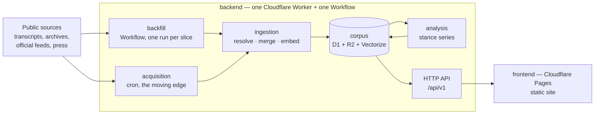

# hitbut — service architecture

The end state of hitbut's runtime: what runs where, what it stores, and how a
public statement travels from a source on the web to a browsable inconsistency
with evidence attached. The deployment boundary itself — Workers back end,
Pages front end, `src/shared` as the only shared surface — is
[`src/README.md`](../../src/README.md)'s; this document describes what runs
inside that boundary, and why this shape over the alternatives.

Two words for one thing: the product says **persona**, the code and the API say
**figure**. They are the same entity, and the code keeps its word because a
rename across a shipped schema, spec and site buys vocabulary and costs
citations.

## The system at a glance

## One Worker, three responsibilities, plus a Workflow

The back end deploys as a **single Worker**: a cron trigger runs acquisition
over the moving edge and then reads what it acquired, and the fetch handler
serves the API. Each stays a separate module — `acquisition/`, `ingestion/`,
`detection/`, `api/` — over the one module they all import, `corpus/`.

The **historical backfill is a Workflow**, not a cron: it is a job with an end,
measured in days, over decades of archives, and it needs durable execution with
per-step retry rather than a schedule. It shares the Worker's bindings and its
ingestion code; what differs is only how it is driven.

*Alternative — a long-running job off-platform, writing to R2*: rejected in
favour of keeping one runtime and one deployment target. The bet is that the
backfill decomposes into slices that each fit inside a Workflow's limits. **That
bet is unverified** — Cloudflare's published step, duration and payload limits
could not be read while this was written, and no number here should be trusted
until someone checks them against the docs. If a slice does not fit, the escape
hatch is a smaller slice before it is a second runtime.

## Storage

- **D1** holds the ledger everything reads: personas, utterances, attestations,
  cluster assignments, stances, findings, and the full-text index for search.
  Relational queries — a persona's timeline, a stance series, an attestation's
  siblings — are the workload.
- **R2** holds the raw payload cache: every fetched page, feed response or
  document is stored verbatim **before** anything interprets it. A parser fix
  then re-runs extraction offline against R2 — no re-fetch, no dependence on
  sites that changed or died. The bucket has two key shapes, because the crawl
  re-reads pages that can change and keeps every fetch, while the backfill walks
  documents that cannot and keeps one object per document so a retried step
  finds it; `src/backend/raw-keys.ts` is where both are written down and why.
  R2 also holds the backfill's intermediate ledger and the generated NDJSON
  export snapshots.
- **Vectorize** holds one embedding per utterance. D1 has no vector type, and
  the retrieval this product needs is nearest-neighbour, not `LIKE`.
- **Queues** are available for the hand-off between stages when a fetch burst
  starts waiting on model latency. Nothing uses one yet: ingestion commits each
  stage before the next, so a retry resumes rather than re-fetching, and a queue
  would add a delivery to reason about for no throughput we currently need.

**The schema moves in three steps, never one.** The deploy applies migrations
before it replaces the Worker, so for the length of a deploy the previous code
is serving against the new schema. Additive changes survive that window and
nothing else does, which makes every schema change three merges — expand,
migrate the readers, contract — rather than one. `dev/gates/schema-migrations.ts`
is what enforces it; the deploy order it reasons about is the `ship main` job
in `.github/workflows/product.yml`.

*Alternatives*: KV rejected — no queries, and the corpus is nothing but
queries. Durable Objects rejected — no per-entity coordination exists that D1
row writes don't already serialize. Committing extracted raw records to git
(the web-scraping pack's default) is adapted rather than adopted: decades of
archives outgrow a git tree, so R2 is the durable raw store, and only the
committed per-source *sample* payloads used as test fixtures live in the repo.

## Data model and stable identifiers

Stable identifiers are a product requirement — researchers and journalists cite
them — so **no identifier is ever reused, renumbered, or deleted**; retirement
is a status, not a deletion.

- **persona (`figure`)** — slug id, display name, role, aliases, status. The
  roster is a **committed input**, not a byproduct of crawling: a speaker who is
  not on it never becomes a tracked persona. Personas are people who put
  themselves in the public eye, in the capacity in which they did so.
- **utterance** — ULID. One thing said once: the persona, the normalized text,
  when it was said, and the language. This is the unit analysis reasons over.
- **attestation** — ULID. One document reporting an utterance: the source, its
  URL, the text *as that document renders it*, when the document was published,
  and the R2 key of the raw payload. **Many attestations per utterance** — one
  speech carried by five outlets is one utterance and five attestations, not five
  statements. Without the split, a persona is compared against themselves and
  every echo reads as agreement.
- **venue and audience** belong to the **utterance**, not the attestation: where
  it was said and to whom is a property of the speech act, and the same words to
  a committee and to a rally are two utterances whose difference is the whole
  point of an anomaly. Who *reported* it is the attestation's business. For an
  op-ed the two coincide — the venue is that publication, with one attestation
  from it — which is consistent rather than a special case.
- **date precision** — `said_at` carries a precision (`day`, `month`, `year`)
  beside it. Thirty years back, a source often establishes "March 1998" and no
  more; recording that as the first of the month invents a fact, and recording
  it as unknown discards one. A date the source does not establish at all stays
  null — never defaulted.
- **cluster** — an emergent subject, discovered from the corpus rather than
  chosen in advance (§ Analysis). Ids are stable; the human-readable label is
  display only, and nothing keys on it — which is what lets it stay **unset**.
  Nothing names a cluster yet (#33), so every cluster the pipeline opens carries
  a null label and the figure page shows no subject chips: an unnamed subject is
  rendered as nothing rather than as a placeholder pretending to be a name.
- **stance** — one utterance's position within one cluster, with the model and
  prompt version that produced it.
- **finding** — ULID. A surfaced inconsistency: its kind (`anomaly` or
  `trend-change`), the utterances it rests on, its rationale, its score, and the
  model and prompt versions. Re-analysis writes a new finding and marks the old
  one superseded, so a cited finding stays resolvable forever.

## Acquisition and backfill

Per-source modules behind **one shared fetch module** — retries, backoff,
bot-wall detection, and raw-before-parse discipline live there once. Each source
module declares the data surface it reads (hydration blob, client API, or
markup — in that order of preference), its own refresh clock, and an extractor
from raw payload to candidate utterances. Fields the extractor doesn't yet
understand are preserved in the raw record, not dropped.

Two drivers over the same modules:

- **The backfill** walks a source's archive in slices — a year of one archive is
  the working unit — as one Workflow run per slice. A slice that fails retries
  without touching its neighbours, and the window is finite, so the job has an
  end. Slices run oldest first: a backfill that starts at the recent end leaves
  the corpus looking complete long before it is. Two properties make the retry
  cheap, and both are asserted rather than assumed (`3.11`, `3.12`) — a slice
  reads and writes nothing another slice relies on, and a re-run reads what the
  previous attempt stored in R2 rather than re-fetching it, because the
  platform's retry re-runs a whole step and every fetch inside one is a request
  to somebody else's server.

  **The slice size is an unchecked bet.** A year is the unit archives are
  organised in, not a size anything says fits inside a Workflow's step, duration
  and payload limits — the session that designed this could not reach
  Cloudflare's documentation to read them. It is a named constant carrying that
  provenance, and the planner takes it as an argument, so closing phase 1 of #34
  is one call site.
- **The cron** covers the moving edge, on each source's own clock. A transcript
  archive and a press feed do not move at the same speed, and running everything
  on the fastest one re-learns a static document thousands of times.

Cloudflare egress comes from datacenter IPs, which some sources bot-block; if a
source needs it, the fetch module routes through a commercial rendering proxy —
a config-level credential, not a per-scraper decision.

**Scanned archives are the open risk.** Material from the 1990s is often a
scan behind a PDF, which means OCR, which is the one stage with no obvious home
inside a Worker. It may force that stage — and only that stage — somewhere else.

## Ingestion

Everything between "bytes arrived" and "the corpus changed". It is one pipeline
whichever driver fed it, and **every stage is idempotent**, because the drivers
retry: a Workflow retries a step, and a cron pass re-runs whatever the last one
did not finish.

1. **Fetch** — raw payload to R2 before any parse, addressed by content hash. An
   unchanged hash means extraction is skipped entirely on a re-run.
2. **Extract** — the source module turns a payload into candidate utterances,
   each carrying the document's own venue and audience metadata.
3. **Resolve** — the speaker string becomes a roster persona, through aliases
   and the document's own context. A speaker who is not on the roster is
   **retained unattributed**, never promoted and never dropped: the raw record
   stays complete and a person decides later.
4. **Merge** — a candidate becomes either a new utterance or another attestation
   of an existing one. Identity is the persona, the date, and near-identity of
   the text; the same speech quoted at three lengths is one utterance whose
   longest attestation is the fullest record of it.
5. **Embed** — one vector per utterance into Vectorize.
6. **Assign** — the utterance joins the nearest existing cluster, or opens a new
   one when nothing is near enough.
7. **Stance** — one model call places the utterance on its cluster's own axis.

Stages 4–7 are one module, `src/backend/ingestion/pipeline.ts`, so the nightly
cron and the backfill Workflow run the same code. Two properties hold across all
of them. Every stage is **keyed on something the payload determines**, so a
replay finds its own work already done rather than writing a second copy —
backfilling decades means replaying constantly, and duplicates would fill a
persona's timeline with copies of one sentence that the analysis then reads as
agreement. And **each stage commits before the next starts**, with a failure
reported rather than thrown: embedding and stance are model calls that
rate-limit and cost money, so a pass that lost the utterance would re-fetch,
re-extract and re-pay for the whole chain on every retry. The outcome names the
last stage that committed, which is what a Workflow step reads to decide whether
to retry.

Steps 5–7 are what make the corpus queryable by *position* rather than only by
word, and each is O(1) per utterance.

## Analysis

The product's claim is that a persona's record is checkable, so detection has to
be defensible before it is clever: for every finding, a reader can see which
utterances it rests on, what was said about them, and by which model and prompt.

**Subjects are discovered, not declared.** There is no committed list of topics.
Utterances are embedded, and clusters emerge from where they fall; a label is
generated for a cluster afterwards and is shown to readers, but pairing and
detection key on the cluster id, never the label. A vocabulary chosen in advance
would decide in advance what the corpus is allowed to be about, and two sources
describing one subject differently would never meet.

**Embedding distance measures aboutness, not agreement.** "I will not cut a
shekel from this line" and "this line was never a priority of mine" sit close
together in embedding space — they are about the same thing, which is exactly
why they are worth comparing and exactly why distance alone cannot tell you they
conflict. So the embedding does retrieval, and a second, cheap step does
judgment: for each utterance, one model call places it on the axis its cluster
already implies, and that value is stored with its confidence and its model and
prompt version.

What that buys is a **stance series**: for each persona and each cluster, a
sequence of positions through time. Two kinds of finding fall out of it:

- **Anomaly** — an utterance that deviates from the persona's prevailing stance
  in that cluster *at that date*. The interesting attribute is then **who they
  were talking to**: the venue and the audience, which the utterance carries
  precisely so this question is answerable.
- **Trend change** — a change point in the series. The interesting attribute is
  **when** it happened, and the finding reports the interval the change falls
  in. *Why* it happened is out of scope; a bounded, sourced "between these two
  dates, this position moved" is the claim the corpus can actually support.

*Alternative — judge every pair of statements*: rejected. It is O(n²) model
calls against a corpus meant to hold decades, it needs a topic vocabulary to
keep the pair count survivable, and a trend is invisible to it — no two
statements are where a trend lives. The pairwise page survives as a *view*: the
two most representative utterances either side of a change point are what the
inconsistency page shows — now the trend-change page, with the anomaly page
beside it as the shape a single deviating utterance needs.

**The old shape is gone.** `statements`, `judgments`, the pairwise judge and the
queue that fed it were dropped in the contract step, taken before the first
deploy rather than after: the window the three-step discipline protects is
between applying migrations and replacing the running Worker, and there was no
running Worker to protect. Detection is pure code over a stance series now, so
the Worker binds D1 and R2 and nothing else until #27.

Only findings above a surfacing threshold reach the product; the full
distribution is kept for tuning. The model call sits behind one interface, so
moving to a different model or an external provider is a config change rather
than a rewrite.

## HTTP API

Read-only public JSON under a versioned path (`/api/v1/...`): personas, a
persona's timeline, utterance detail with its attestations, findings, and
search. Cursor pagination, open CORS, no accounts, no write surface — the only
writers are the cron trigger and the backfill's Workflow. Responses
are edge-cacheable with short TTLs; bulk export is served as generated snapshots
from R2 rather than paginated through D1.

## Frontend

A static site on Cloudflare Pages — no Pages Functions, no server rendering:
everything the site shows is public and comes from `/api/v1`, so the API stays
the one back end and the front end stays a pile of cacheable assets. Page
inventory: home (search + recent findings), persona (profile, timeline,
findings), utterance detail (text, attestations, sources), finding detail (the
utterances side by side with rationale and sources), search results, and a
methodology page explaining how detection works and how to report an error.

## How requirements are proven against this

Data-level requirements (extraction, corpus invariants, ingestion, analysis)
assert on values directly, with committed real sample payloads as fixtures, and
with the model and the vector store behind interfaces a case can script. UI
requirements drive this front end in headless Chromium against a local
`wrangler` preview of the real deployment, asserting on committed screenshot
goldens — the harness runs what ships, not a mock shell.
