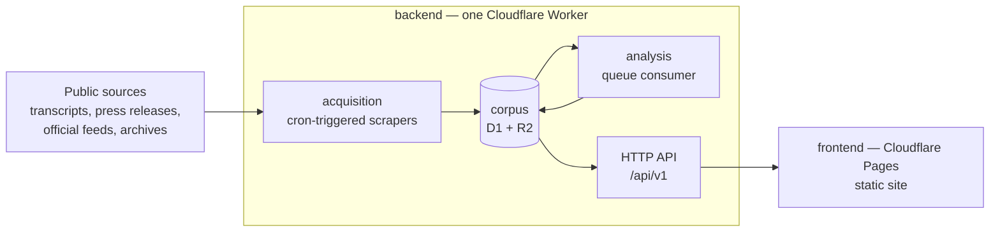

# hitbut — service architecture

The end state of hitbut's runtime: what runs where, what it stores, and how a
public statement travels from a source on the web to a browsable inconsistency
with evidence attached. The deployment boundary itself — Workers back end,
Pages front end, `src/shared` as the only shared surface — is
[`src/README.md`](../../src/README.md)'s; this document describes what runs
inside that boundary, and why this shape over the alternatives.

## The system at a glance

## One Worker, three responsibilities

The back end deploys as a **single Worker** with three entry points: a cron
trigger runs acquisition, a queue consumer runs analysis, and the fetch handler
serves the API. The three responsibilities stay separable as modules
(`src/backend/acquisition/`, `analysis/`, `api/`), with `src/backend/corpus/`
the only module the other three import — no acquisition code in the API path,
no API code in a scraper.

*Alternative — three Workers behind service bindings*: rejected for now. It
buys process isolation the product doesn't need yet and costs three deploys,
three configs, and RPC across what is currently one data model. The module
boundaries keep that split cheap if scale ever demands it.

## Storage

- **D1** holds the corpus: figures, sources, statements, inconsistencies, and
  a full-text index for search. The corpus is structured text at modest scale —
  relational queries (per-figure timelines, statement pairs) are the workload,
  and SQLite's FTS covers search without another service.
- **R2** holds the raw payload cache: every fetched page or API response is
  stored verbatim, keyed by source URL and fetch time, **before** anything
  interprets it. A parser fix then re-runs extraction offline against R2 —
  no re-fetch, no dependence on sites that changed or died. R2 also serves
  generated bulk-export snapshots (NDJSON) for researchers.
- **Queues** carry the hand-off from acquisition to analysis, so a scrape
  burst never waits on model latency and a failed analysis retries without
  re-scraping.

*Alternatives*: KV rejected — no queries, and the corpus is nothing but
queries. Durable Objects rejected — no per-entity coordination exists that D1
row writes don't already serialize. Committing extracted raw records to git
(the web-scraping pack's default) is adapted rather than adopted: the corpus
outgrows a git tree quickly, so R2 is the durable raw store, and only the
committed per-source *sample* payloads used as test fixtures live in the repo.

## Data model and stable identifiers

Stable identifiers are a product requirement — researchers and journalists
cite them — so **no identifier is ever reused, renumbered, or deleted**;
retirement is a status, not a deletion.

- **figure** — slug id (`jane-doe`), display name, role, aliases.
- **source** — URL, publisher, fetched-at, R2 key of the raw payload,
  extraction status.
- **statement** — ULID assigned at first extraction; quote text, speaker
  (figure id), the date it was made, surrounding context, source id, topic
  tags. A date the source doesn't establish stays null — never defaulted.
- **inconsistency** — ULID; the two statement ids (earlier, later), kind
  (`contradiction` or `position-shift`), score, the model and prompt version
  that produced it, and a human-readable rationale. Re-analysis writes new
  records and marks old ones superseded, so a cited inconsistency stays
  resolvable forever.

## Acquisition

Per-source scraper modules behind **one shared fetch module** — retries,
backoff, bot-wall detection, and raw-before-parse discipline live there once,
per the declared web-scraping pack rules. Each source module declares the data
surface it reads (hydration blob, client API, or markup — in that order of
preference), its own refresh clock (a transcript archive and a press-release
feed do not move at the same speed), and an extractor from raw payload to
statement records. Fields the extractor doesn't yet understand are preserved
in the raw record, not dropped.

Cloudflare egress comes from datacenter IPs, which some sources bot-block; if
a source needs it, the fetch module routes through a commercial rendering
proxy — a config-level credential, not a per-scraper decision.

## Analysis

For each statement arriving off the queue, candidate pairs are drawn from the
same figure with overlapping topics, and each pair is judged by an LLM against
a **committed, versioned prompt**. Every judgment stores both statement ids,
the score, the rationale, and the model + prompt version — the defensible
trail: a reader can always see exactly which two statements were compared and
why the pair was flagged. Only high-confidence pairs surface in the product;
the full score distribution is kept for tuning.

v1 binds the model call to **Workers AI** — in-platform, no external
credential, no egress. The analysis module isolates the model call behind one
interface, so moving to an external API is a config change, not a rewrite.

## HTTP API

Read-only public JSON under a versioned path (`/api/v1/...`): figures, a
figure's statement timeline, statement detail, inconsistencies, and search.
Cursor pagination, open CORS, no accounts, no write surface — the only
writers are the cron trigger and the queue consumer. Responses are
edge-cacheable with short TTLs; bulk export is served as generated snapshots
from R2 rather than paginated through D1.

## Frontend

A static site on Cloudflare Pages — no Pages Functions, no server rendering:
everything the site shows is public and comes from `/api/v1`, so the API stays
the one back end and the front end stays a pile of cacheable assets. Page
inventory: home (search + recent inconsistencies), figure (profile, statement
timeline, inconsistencies), statement detail (quote, context, source), 
inconsistency detail (the two statements side by side with rationale and
sources), search results, and a methodology page explaining how detection
works and how to report an error.

## How requirements are proven against this

Data-level requirements (extraction, corpus invariants, analysis) assert on
values directly, with committed real sample payloads as fixtures. UI
requirements drive this front end in headless Chromium against a local
`wrangler` preview of the real deployment, asserting on committed screenshot
goldens — the harness runs what ships, not a mock shell.
