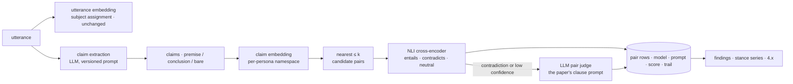

# Claim-distance search — the paper, the technology, and the comparison to run

What this document settles: how hitbut should measure the distance between two things a
persona said, which technologies can do that for Hebrew at the corpus's intended scale,
and how every claim gets compared against every other without the O(n²) model calls
[`DESIGN.md`](DESIGN.md) rejected. It ends in a comparison that has to be *run* before any
of it is a decision; the harness that runs it is [`dev/similarity/`](../../dev/similarity/README.md),
and the run itself waits on the models being reachable (#27). Tracking: #209.

Nothing here chooses a model. The choice is made on the comparison's output, by the owner.

## 1. The paper: Heldring & Torres, *Logical Embeddings for Argument Analysis* (arXiv 2608.15325)

### What it claims

An argument is a pair `(Φ, φ)` — a finite set of premises and a conclusion the premises
entail. Two arguments are compared on two Jaccard overlaps: their premise sets *modulo
logical equivalence*, and the sets of CNF consequences of their conclusions (so "the earth
is round and blue" partially matches "the earth is round"). The convex combination
`sim^σ = σ·s_syn + (1−σ)·s_sem` is the syntactic–semantic Jaccard measure of Amgoud &
David (2018) and David (2021). The paper's own contributions are:

1. **`sim^σ` is a positive semi-definite kernel** on the set of arguments (Theorem 2), so
   by Moore–Aronszajn it induces an RKHS and a feature map — the *logical embedding*.
2. **The embedding loses no logical information** (Theorem 3): two arguments get the same
   vector exactly when they are equivalent — same premises up to equivalence, equivalent
   conclusions. Similarity is 1 iff equivalent (Theorem 1, inherited from Amgoud & David).
3. **An NLP recipe**: an LLM decomposes text into conclusion then premises (two chained
   prompts); an LLM rewrites the conclusion into CNF clauses; an entailment model judges
   every clause pair in both directions, and mutual entailment is the equivalence relation
   the Jaccard counts run on. On a corpus, the Gram matrix of pairwise scores is reduced
   by kernel PCA to a fixed-width vector per argument.
4. **Evidence**: on 1,137 arguments from three topics of IBM-ArgQ-6.3kArgs, 100-dimensional
   logical embeddings beat GloVe, BERT, RoBERTa, SBERT and OpenAI `text-embedding-3-small`
   on a pro/con classification (F1 0.84–0.88 vs 0.67–0.87), and concatenating them with
   the OpenAI embedding is best overall.

### What holds, and what to weigh

- **The framing is exactly hitbut's problem.** The paper opens with the failure `1.11`
  names: a full-text similarity score rewards "the same abstract concept of necessity"
  across domains and penalises a more specific argument on the same topic. Its Figure 2
  makes the point sharply — an LLM full-argument similarity graph over one topic is 98.5%
  connected, the logical one 7%, and only the sparse one separates pro from con. Distance
  in a semantic embedding measures aboutness. This is a good citation for the design
  decision the repo already made.
- **The theory is sound but modest.** Theorems 2–3 follow from the measure being a convex
  combination of two Jaccard indices over sets (a Jaccard index is a known PSD kernel) and
  from Theorem 1. The kernel is the *measure*; the embedding adds nothing you could not do
  with the measure alone, except the finite-dimensional coordinates you get from kernel
  PCA — which are only defined on the corpus you built the Gram matrix from.
- **The implementation that performs is not the one the theory covers.** Appendix B.3 says
  the reported numbers come from a *pairwise* estimator: equivalence classes are built
  per pair, so different Gram entries use different equivalence relations and PSD-ness is
  not guaranteed. The PSD variant (global clause equivalence classes, giant components
  split by recursive spectral bisection to size ≤ 20) scores lower (Table 2 vs Table 1).
  The practical method is "clause-level mutual-entailment Jaccard", and its transparency
  — you can point at which clauses matched — is its real advantage, not the kernel.
- **The measure cannot see a contradiction.** Premise sets are consistent by definition
  and the conclusion overlap counts *shared* consequences, so "the line will be cut" and
  "the line will not be cut" share nothing and score exactly as two unrelated arguments
  do. Figure 2's clean pro/con split is *absence of overlap*, not detection of conflict.
  For a product whose finding is the inconsistency, the clause-level judgment has to be
  three-way (entails / contradicts / neutral), which the paper's yes/no prompt is not; the
  harness's `logical` adapter makes that extension and says so.
- **Two formulas, one number.** The main text's `s_syn` counts equivalence *classes*;
  Definition 20 in the appendix counts *formulas* via a common-formulas operator. They
  agree only when every premise set is non-redundant, which an LLM decomposition does not
  guarantee — on the paper's own Figure 4 example (one premise equivalent to both on the
  other side) the class count gives 1/2 and the formula count 1/3. The figures carry the
  reported score, so the class count is what the harness implements and pins.
- **The evaluation is small and single-language.** 1,137 English arguments, one task, one
  split; no comparison against argument-similarity datasets where the community already
  measures this (UKP ASPECT, BWS-ArgSim), and no ablation on `σ`, on the entailment model,
  or on decomposition quality. "Aim to test it against literature benchmarks" is in the
  abstract's future tense.
- **The code is not public.** The repository the paper names holds a README and a Dropbox
  link; there is nothing to run. Reproducing means re-implementing from Appendix B.3.1's
  two prompts, which are reported in full.
- **The cost is quadratic twice over.** Every argument pair needs every clause pair judged
  in both directions: `O(n²·m²)` LLM or NLI calls for `n` arguments of `m` clauses. Their
  own doping-topic graph is ~1,300 arguments. Decades of a persona's record is not.

### What to take from it

Three things transfer, none of them the kernel:

1. **Decompose before you compare.** An utterance is a paragraph of rhetoric; the thing
   that can be equal, entailed or contradicted is a clause. Compare clauses.
2. **Equivalence is mutual entailment, judged, not distance.** The measure counts *judged*
   relations, which is `1.11`'s "position is a judgment, not geometry" applied to pairs.
3. **Keep the trail.** A score built from named clause matches is a finding a reader can
   check, which is what `4.x` demands of every finding.

And one thing to refuse: building the Gram matrix. The design's stance-series approach
stays; the paper's method becomes a *pair judge* that runs only on candidate pairs that
retrieval already put together (§4).

## 2. The unit: claim, sentence, or paragraph?

The corpus stores **utterances** — one thing said once, normalised text, often a paragraph
— and compares them by an embedding of the whole text. Three units are candidates:

| Unit | What it can see | What it cannot |
|---|---|---|
| **Paragraph / utterance** | the subject; enough context to disambiguate pronouns and ellipsis | a specific commitment buried in rhetoric; two positions in one paragraph average into one vector |
| **Sentence** | a proposition at the granularity people quote | a sentence lifted from context ("this will not happen" — what?) |
| **Claim** (an atomic, decontextualised declarative sentence) | exactly what can be equal to, entail or contradict another claim | nothing on its own; the claim must carry the utterance it came from, or the trail breaks |

The fact-checking literature converged on the third: claim extraction as a distinct stage
producing self-contained declarative sentences, with a framework for measuring whether
extraction is *faithful* (no invented content) and *decontextualised* (Metropolitansky &
Larson, "Towards Effective Extraction and Evaluation of Factual Claims", ACL 2025 —
Claimify). The paper under review does the same under another name: premises and a CNF
conclusion are atomic claims with their logical role attached.

**Recommendation: claims are the unit of comparison; utterances stay the unit of record.**
A claim is derived, keyed on `(utteranceId, index)`, carries its role (`premise` /
`conclusion` / `bare`), and is never cited on its own — a finding names utterances, as
`1.13` requires, and the claims are the trail *inside* the finding that says which part
matched. The utterance embedding keeps doing what it does today — subject assignment,
where aboutness is the right measure. The claim embedding does candidate retrieval for
the pair judge. Two vectors per utterance family, two questions.

This is also the one place decomposition quality gets measured: a claim extractor that
hallucinates a commitment manufactures an inconsistency. The comparison (§5) scores
extraction faithfulness on its own before any pair metric is read.

## 3. The technology, for Hebrew

Every candidate below is judged on one question first: **does it work on Hebrew political
speech?** Most model cards say "100+ languages"; almost none report a Hebrew number. What
follows is what is known, with the Hebrew evidence marked where it is thin.

### 3.1 Bi-encoders: one vector per text, distance is cosine

The retrieval tier. Linear in the corpus, and the only thing that scales to all-pairs.

| Model | Dims | Hebrew evidence | Reachable from the Worker |
|---|---|---|---|
| **BGE-M3** (BAAI, MIT) | 1024, dense + sparse + ColBERT heads, 8k context | "100+ working languages"; MIRACL/MLDR cover 18/13 languages, neither includes Hebrew — coverage comes from mC4-style pretraining and is **unmeasured** | yes: `@cf/baai/bge-m3` on Workers AI, $0.012 per M input tokens |
| **multilingual-e5-large / -instruct** (Microsoft) | 1024 | mC4-trained, 100 languages; the model most SemEval-2025 Task 7 systems built on | no — self-host or a third-party API |
| **Qwen3-Embedding-0.6B** | 1024, MRL | MMTEB score 64.34 at 0.6B parameters per the leaderboard; Hebrew per-task numbers exist on MMTEB but were not read for this document | yes: `@cf/qwen/qwen3-embedding-0.6b` on Workers AI |
| **EmbeddingGemma-300m** (Google) | 768, MRL | "100+ spoken languages"; small, cheap, unmeasured on Hebrew | yes: `@cf/google/embeddinggemma-300m` |
| **OpenAI text-embedding-3-large / small** | 3072 / 1536 | the paper's strongest baseline (English); multilingual by MIRACL; Hebrew unmeasured | external API |
| **Gemini Embedding 2** (preview, March 2026) | 3072, MRL | 100+ languages; multimodal; **exceeds Vectorize's 1536-dimension cap** unless truncated by MRL | external API |
| **Cohere embed-v4** | MRL | 100+ languages | external API |
| **Hebrew-only encoders** — DictaBERT, AlephBERT, HeBERT | 768 | the best Hebrew *token* encoders; none ships a sentence-embedding head, so pooled vectors need contrastive fine-tuning on Hebrew pairs before they are usable for retrieval | self-host |

Two facts constrain the field. **Vectorize holds at most 1,536 dimensions**, float32, so a
3,072-dimensional model is usable only through Matryoshka truncation, and truncation is a
measured, not assumed, quality loss. And **the vector store is priced by dimensions**
(stored and queried), so 1024 vs 3072 is a 3× line item at every scale.

Where the models come from also matters for `1.11`'s provenance: a model behind Workers AI
has a stable id the stance row can carry; a preview API model does not.

### 3.2 Cross-encoders and rerankers: score a pair, no vector

Quadratic in what they are given, so they run on retrieved candidates only. They see both
texts at once and beat bi-encoders on the pair they are shown.

- **NLI cross-encoders** answer the exact question a pair judge needs — entailment,
  contradiction, neutral. `mDeBERTa-v3-base-xnli-multilingual-nli-2mil7` (279M) was
  trained on XNLI plus a 26-language machine-translated set that **includes Hebrew**
  (chosen, its card says, because Israel is "polit-economically important"). The only
  Hebrew-native NLI resource is **HebNLI** (Webiks for MAFAT): MultiNLI machine-translated
  by Gemini, 302k sentences, with an **884-pair human-verified gold test set** (87.4%
  annotator agreement, licence "other" — check before use). HebNLI is the obvious
  fine-tuning and evaluation set; its genres (government, fiction, travel) are not
  political speech, which is why §5 needs pairs of our own.
- **Retrieval rerankers** (`bge-reranker-v2-m3`, `jina-reranker-v2-base-multilingual`,
  Cohere Rerank 3.5) score query–passage relevance, not entailment. Their language lists
  do not name Hebrew. Workers AI ships `@cf/baai/bge-reranker-base`, which is English/
  Chinese. Useful as a second retrieval stage; not a substitute for an NLI judgment.
- **Cost shape**: a 279M cross-encoder on a CPU runner scores roughly hundreds of pairs
  per second — thousands of times cheaper than an LLM call per pair. It is the tier that
  makes "judge every candidate pair" affordable.

### 3.3 LLM judgment: the paper's tier

A prompt per pair (or per clause pair) returning a label, a reason and a confidence.
The paper's clause-entailment prompt is reproduced in its Appendix B.3.1 and is the
starting prompt for the `logical` method in the harness. Political-inconsistency work
finds LLMs roughly at human level on *whether* two statements are inconsistent and below
the ceiling on *which kind* (Sagimbayeva et al., "Misleading through Inconsistency",
2025 — 698 annotated pairs from Wahl-O-Mat and Smartvote; German/Swiss, not Hebrew).

On-platform options today: `@cf/qwen/qwen3-30b-a3b-fp8` ($0.051/M in, $0.335/M out),
`@cf/openai/gpt-oss-120b` ($0.35/M in), `@cf/meta/llama-4-scout-17b-16e-instruct`
($0.27/M in), `@cf/google/gemma-4-26b-a4b-it` ($0.10/M in). Hebrew quality of each is
**unmeasured here**; it is a column of the comparison. Workers AI's asynchronous batch
API is the right lane for the offline all-candidates pass; per-request calls are for the
nightly edge.

Where this tier sits: last, on the pairs the cheaper tiers could not settle, and always
recorded with model and prompt version — the `StanceModel` port already has the shape.

### 3.4 Lexical and near-duplicate methods: free, and not nothing

- **Folded-token overlap** using the repo's own `tokenize`/`variantsOf` (Hebrew clitic
  stripping, final-form folding) is a real baseline — it is what the search index already
  does — and it runs today with no model. It is also the right tool for the *merge* stage's
  "same speech at three lengths": containment of folded shingles (MinHash / SimHash
  families) finds near-duplicate attestations far more cheaply than embeddings and with a
  threshold that means something.
- **BM25 over folded terms** (D1's FTS5 already indexes them) is the hybrid partner
  SemEval-2025 Task 7 systems paired with dense retrieval: lexical recall catches the
  named entity and the number the embedding blurs.

### 3.5 Vector stores and all-pairs search

| Store | Fit |
|---|---|
| **Vectorize** (the design's choice) | up to 20M vectors per index, 1,536 dims, `topK` ≤ 100 (≤ 50 with metadata), metadata filters on ≤ 10 indexed properties (first 64 bytes of a string), up to 50,000 namespaces on a paid plan. Priced per dimension stored and queried, free 30M queried / 5M stored per month, then $0.01 per M queried. A namespace per persona is within limits and turns "this persona's own record" (`4.1`) into a filter the store applies. |
| **D1 + brute force** | exact cosine over a persona's own claims in the Worker: at a few thousand claims per persona this is a millisecond and needs no vector index at all. Worth measuring before assuming ANN is needed per persona. |
| **Off-platform batch** (FAISS / hnswlib / pgvector / LanceDB) | for the *comparison* itself, and for a one-off all-pairs pass over a backfilled archive: exact `k`-NN on a runner, results written back as pair rows. Not a runtime dependency. |

**All-pairs without n².** The corpus-wide comparison is not a Gram matrix. It is:
`n` embeddings (linear), `n` bounded nearest-neighbour queries (linear in `n`, each ≤ 100
neighbours, within the persona's own namespace), giving at most `100n` candidate pairs;
then the cross-encoder on those, and the LLM only on the pairs the cross-encoder leaves
uncertain or labels contradiction. At `n` = 10⁶ claims that is ≤ 10⁸ cheap cross-encoder
pairs, of which a small fraction reaches an LLM. If a Gram matrix over a subset is ever
wanted for the paper's kernel-PCA coordinates, the Nyström approximation with `m ≪ n`
landmarks (Williams & Seeger, 2001) is the standard way to get them at `O(n·m)`.

## 4. The design this implies

Two vectors, three tiers, one trail — an extension of the pipeline in `DESIGN.md`, not a
replacement:

- **Claims are a new table** keyed on `(utteranceId, index)`, with role, text, the
  extractor's model and prompt version — the same provenance rule as a stance. A new
  extractor version writes new claims beside the old; nothing is overwritten.
- **Pairs are a new table** — `(claimA, claimB, method, modelVersion, promptVersion,
  relation, score, trail)` — with the trail being the matched clauses for the LLM tier
  and the raw class probabilities for the NLI tier. Idempotent on its key like every other
  stage; the offline pass and the nightly edge write the same rows.
- **Detection reads pairs** in addition to the stance series: a `contradicts` pair within
  one persona and one subject is a candidate anomaly with its evidence already attached.
  The stance-series machinery is untouched; this adds a second, sharper source.
- **The schema change is expand → migrate → contract**, per `dev/gates/schema-migrations`;
  this document proposes the expand step only.

None of this lands before the comparison says which method deserves it.

## 5. The comparison

The thing to run once models are reachable. Its inputs, outputs and cost are fixed here so
the run is a config change, and the harness in `dev/similarity/` executes the same
protocol today against the lexical baseline and scripted models, which is how the
protocol itself is proven.

### 5.1 The labelled pair set

A JSONL file of **claim pairs from one persona**, each labelled with one relation:

| Relation | Meaning | Why it is in the set |
|---|---|---|
| `equivalent` | mutual entailment — the same commitment in different words | the paper's `≈`; the merge stage's paraphrase case |
| `entails` | A commits to B, not the reverse | partial overlap, the CNF-consequence case |
| `contradicts` | A and B cannot both hold | the product's finding |
| `same-subject` | about the same thing, no logical relation | the aboutness-not-agreement case; must score *low* on a pair judge and *near* on a subject embedding |
| `unrelated` | different subject | the negative |

Format: `dev/similarity/pairs.ts` (one record per line: two claims each carrying its
utterance id and text, the relation, an optional annotator note). Requirements on the set:

- **Real Hebrew political speech, annotated by two people**, with disagreement kept as a
  field rather than resolved silently; HebNLI's 87% agreement is the bar to expect.
- **Hard negatives on purpose**: same-subject pairs that share vocabulary, and paraphrases
  that share none. A set without them measures the lexical baseline's strength, not the
  models' weakness.
- **Size**: 500 pairs is the floor at which a difference of five F1 points is not noise
  on a five-class label; 1,000 is the target. Reuse HebNLI's gold set (884 pairs) as a
  second, off-domain column so a Hebrew NLI number exists that other people can compare.
- **Until real speech exists in the repo, the committed set is fictional** (the sample
  file), which is the repository's standing rule for every fixture. It proves the
  harness; it measures nothing about a model.

### 5.2 Methods compared

Each method is an adapter over the ingestion ports (`Embedder` for retrieval; a
`PairJudge` for the pair tiers) so the harness never knows what a model is:

| Method | Tier | Runs today | Hebrew status |
|---|---|---|---|
| `lexical` — folded-token Jaccard | baseline | yes | this repo's own folding |
| `embedding:<model>` — cosine on claim vectors | retrieval | via port | see §3.1 |
| `nli:<model>` — cross-encoder | judge | via port | mDeBERTa-2mil7; HebNLI fine-tune |
| `llm:<model>` — full-pair prompt | judge | via port | unmeasured |
| `logical:<model>` — decompose, CNF, clause mutual entailment (the paper) | judge | via port | unmeasured; the same LLM as `llm:` |

### 5.3 What is measured

1. **Retrieval**: for each claim, are its `equivalent`/`entails`/`contradicts` partners in
   the top-`k` neighbours? Recall@k for k ∈ {5, 20, 100} and MRR. This decides the
   candidate-generation model and the `k` the all-pairs pass uses.
2. **Subject separation**: AUROC of the embedding distance separating `same-subject` from
   `unrelated` — the number `NEAR_ENOUGH` in `pipeline.ts` should be set from, and the
   only place the current "conservative" 0.35 stops being a guess.
3. **Pair judgment**: per-relation precision, recall and F1 over the labelled pairs, with
   **contradiction recall** reported on its own — a judge that misses contradictions is
   useless to this product however good its macro-F1.
4. **Extraction faithfulness** (once an extractor exists): fraction of extracted claims a
   second annotator marks as *not stated* in the utterance. Read this first; every pair
   metric is conditional on it.
5. **Cost**: model calls, tokens and wall-clock per 1,000 pairs, per method, from the
   harness's own counters — the number that decides which tier each pair reaches.

### 5.4 How the corpus-wide run then goes

1. Offline, on a runner, over a backfilled archive: extract claims, embed, exact `k`-NN
   within each persona, cross-encode every candidate pair, LLM-judge the contradictions
   and the uncertain band, write pair rows. Everything keyed, so a re-run is a no-op.
2. Nightly, in the Worker, for the moving edge: the same stages for new utterances only,
   against the persona's namespace in Vectorize.
3. The pair rows feed detection; the model and prompt versions on every row are what let
   a later model re-run without touching a cited finding (`1.12`).

## 6. Open questions

- Which persona's real speech becomes the labelled set, and who the two annotators are
  (#32 decides the source; this decides the sample).
- HebNLI's licence ("other") — read it before it is used for fine-tuning.
- Whether a Hebrew-specific contrastive fine-tune of DictaBERT beats the multilingual
  models on our pairs; it is the one candidate that cannot be tried without training.
- Gemini Embedding 2's 3,072 dimensions against Vectorize's 1,536: MRL truncation is a
  measured loss, and the measurement is column 1 of §5.3.
- Whether per-persona brute force in D1 makes Vectorize unnecessary for the pair tier.

## Sources

- Heldring & Torres, *Logical Embeddings for Argument Analysis*, arXiv:2608.15325 (Aug 2026): <https://arxiv.org/abs/2608.15325>; code page (README only): <https://github.com/lheldring/logical_embeddings>
- Amgoud & David, *Measuring Similarity between Logical Arguments*, KR 2018; David, PhD thesis, 2021 — as cited by the paper.
- Steck, Ekanadham & Kallus, *Is Cosine-Similarity of Embeddings Really About Similarity?*, arXiv:2403.05440.
- Metropolitansky & Larson, *Towards Effective Extraction and Evaluation of Factual Claims* (Claimify), ACL 2025: <https://arxiv.org/abs/2502.10855>
- Sagimbayeva, Bahçeci & Weber, *Misleading through Inconsistency: A Benchmark for Political Inconsistencies Detection*, 2025: <https://arxiv.org/abs/2505.19191>
- SemEval-2025 Task 7 overview, *Multilingual and Crosslingual Fact-Checked Claim Retrieval*: <https://arxiv.org/abs/2505.10740> — MultiClaim (206k claims, 28k posts); winning pattern: multilingual bi-encoder fine-tuned with hard negatives, reranking, weighted voting; translating to English and staying multilingual perform comparably.
- HebNLI (NNLP-IL / Webiks for MAFAT): <https://github.com/NNLP-IL/HebNLI>, <https://huggingface.co/datasets/HebArabNlpProject/HebNLI>
- multilingual-NLI-26lang-2mil7 (includes `he`): <https://huggingface.co/datasets/MoritzLaurer/multilingual-NLI-26lang-2mil7>; model: <https://huggingface.co/MoritzLaurer/mDeBERTa-v3-base-xnli-multilingual-nli-2mil7>
- BGE-M3 model card: <https://huggingface.co/BAAI/bge-m3>; on Workers AI: <https://developers.cloudflare.com/workers-ai/models/bge-m3/>
- MMTEB, *Massive Multilingual Text Embedding Benchmark*: <https://arxiv.org/abs/2502.13595>; leaderboard: <https://huggingface.co/spaces/mteb/leaderboard>
- Workers AI model catalogue: <https://developers.cloudflare.com/workers-ai/models/>; pricing: <https://developers.cloudflare.com/workers-ai/platform/pricing/>
- Vectorize limits: <https://developers.cloudflare.com/vectorize/platform/limits/>; pricing: <https://developers.cloudflare.com/vectorize/platform/pricing/>; metadata filtering: <https://developers.cloudflare.com/vectorize/reference/metadata-filtering/>
- Williams & Seeger, *Using the Nyström Method to Speed Up Kernel Machines*, NeurIPS 2001.
- Malkov & Yashunin, *Efficient and robust approximate nearest neighbor search using HNSW graphs*, arXiv:1603.09320.

Read on 2026-09-04. Figures quoted from vendor pages are the pages' figures on that day.
